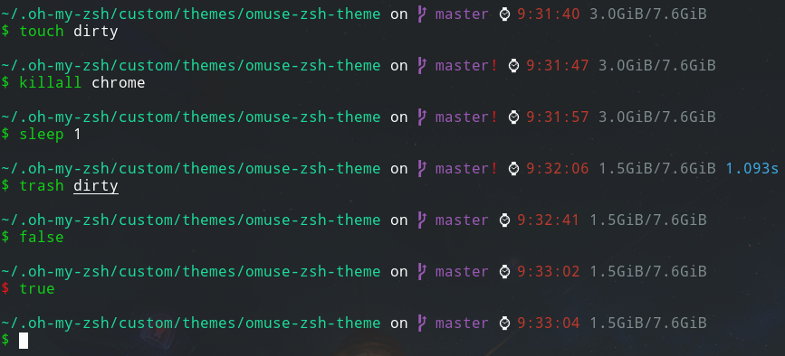

# omuse-zsh-theme

A zsh theme based on [amuse](https://github.com/ohmyzsh/ohmyzsh/blob/master/themes/amuse.zsh-theme).



## Features

- Always display the absolute pwd.
- Git prompt with the current branch (or SHA1 in detached HEAD mode) and "!" if dirty.
- The current time.
- The RAM usage.
- Whether `ssh-add` has added identities.
- Time used by the last command, if more than 200ms.
- Red "$" if the command fails.

## Install

### [oh-my-zsh](http://ohmyz.sh/)

```sh
git clone https://github.com/ouuan/omuse-zsh-theme.git "$ZSH_CUSTOM/themes/omuse"
```

```sh
# ~/.zshrc

ZSH_THEME="omuse/omuse"
```
